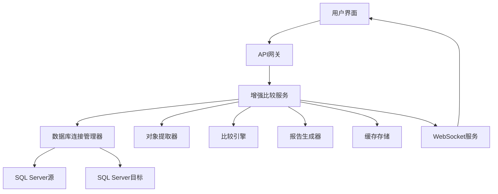

# SQL Server数据库比较工具 - 完整技术方案文档

## 📋 目录

1. [项目概述](#1-项目概述)
2. [整体架构](#2-整体架构)
3. [技术栈分析](#3-技术栈分析)
4. [数据库连接架构](#4-数据库连接架构)
5. [核心功能模块](#5-核心功能模块)
6. [Web应用架构](#6-web应用架构)
7. [实时通信机制](#7-实时通信机制)
8. [报告生成系统](#8-报告生成系统)
9. [数据缓存与会话管理](#9-数据缓存与会话管理)
10. [部署架构](#10-部署架构)
11. [性能优化](#11-性能优化)
12. [安全机制](#12-安全机制)
13. [扩展性设计](#13-扩展性设计)
14. [运维监控](#14-运维监控)

---

## 1. 项目概述

### 1.1 项目简介

SQL Server数据库比较工具是一个基于Node.js的企业级数据库结构比较解决方案，支持对SQL Server数据库进行全面的结构差异分析，包括表、视图、存储过程、函数等数据库对象的比较。

### 1.2 核心特性

- **多模式支持**: CLI命令行模式和Web界面模式
- **全对象比较**: 支持表结构、索引、视图、存储过程、函数的深度比较
- **实时进度跟踪**: 基于WebSocket的实时进度更新和日志推送
- **多格式报告**: 自动生成HTML、Excel、JSON格式的详细比较报告
- **会话恢复**: 支持任务会话恢复和数据缓存机制
- **双重认证**: 同时支持Windows集成认证和SQL Server认证

### 1.3 技术目标

- **高可用性**: 99.9%的服务可用性保障
- **高性能**: 支持大型数据库(1000+表)的快速比较
- **可扩展性**: 模块化设计，支持功能扩展
- **用户体验**: 现代化的Web界面和简洁的CLI工具

---

## 2. 整体架构

### 2.1 多层架构设计

```
┌─────────────────────────────────────────────────────────────┐
│                    用户接口层                                │
├─────────────────────────────────────────────────────────────┤
│  CLI工具           │    Web前端界面 (React + Ant Design)    │
│  (Commander.js)    │    端口: 3000                          │
└─────────────────────┴─────────────────────────────────────────┤
                     │    Web API层                           │
                     │    (Express.js + Socket.IO)           │
                     │    端口: 3001                          │
├─────────────────────────────────────────────────────────────┤
│                    业务逻辑层                                │
├─────────────────────────────────────────────────────────────┤
│  比较引擎     │  数据提取器   │  报告生成器  │  缓存管理器    │
│  (Comparers)  │  (Extractors) │  (Reporters) │  (Cache)      │
├─────────────────────────────────────────────────────────────┤
│                    数据访问层                                │
├─────────────────────────────────────────────────────────────┤
│           数据库连接管理 (mssql + Connection Pool)           │
├─────────────────────────────────────────────────────────────┤
│                    数据存储层                                │
├─────────────────────────────────────────────────────────────┤
│  SQL Server    │  文件系统存储  │  日志存储   │  报告存储     │
│  (源/目标)     │  (JSON缓存)   │  (Winston)  │  (多格式)     │
└─────────────────────────────────────────────────────────────┘
```

### 2.2 核心组件关系



---

## 3. 技术栈分析

### 3.1 后端技术栈

#### 核心框架
- **Node.js 18+**: 现代JavaScript运行时
- **TypeScript 5.x**: 强类型语言支持，提供更好的开发体验

#### Web框架
- **Express.js 4.18**: 轻量级Web框架
- **Socket.IO 4.7**: 实时双向通信
- **Helmet**: 安全中间件
- **CORS**: 跨域资源共享支持
- **Morgan**: HTTP请求日志中间件

#### 数据库连接
- **mssql 11.0**: SQL Server连接驱动
- **连接池管理**: 自动化连接池优化

#### 日志和监控
- **Winston 3.17**: 结构化日志系统
- **UUID**: 唯一标识符生成

#### 工具库
- **Commander.js**: CLI命令行解析
- **Chalk**: 终端颜色输出
- **Joi**: 数据验证框架
- **ExcelJS**: Excel文件生成
- **Handlebars**: HTML模板引擎

### 3.2 前端技术栈

#### 核心框架
- **React 18.2**: 现代化前端框架
- **TypeScript**: 类型安全开发
- **Vite 5.0**: 极速构建工具

#### UI框架
- **Ant Design 5.12**: 企业级UI组件库
- **@ant-design/icons**: 图标库

#### 状态管理和通信
- **Axios 1.6**: HTTP客户端
- **Socket.IO-Client**: WebSocket客户端
- **React Router DOM**: 路由管理

### 3.3 开发和构建工具

#### 代码质量
- **ESLint**: 代码风格检查
- **TypeScript编译器**: 类型检查和编译
- **Jest**: 单元测试框架

#### 构建和部署
- **TSC (TypeScript Compiler)**: 后端编译
- **Vite**: 前端构建
- **ts-node**: 开发环境运行
- **rimraf**: 清理工具

---

## 4. 数据库连接架构

### 4.1 连接管理策略

#### 4.1.1 服务器地址解析

支持多种服务器地址格式:

```typescript
interface ParsedServer {
  server: string;
  port: number;
  hasExplicitPort: boolean;
}

// 支持的格式:
// - localhost (默认端口1433)
// - 192.168.1.100:1435 (冒号分隔端口)
// - server.example.com,26923 (逗号分隔端口)
// - SERVER\INSTANCE (命名实例)
```

#### 4.1.2 认证模式支持

**Windows集成认证**:
```typescript
{
  authentication: {
    type: 'windows'
  }
}
```

**SQL Server认证**:
```typescript
{
  authentication: {
    type: 'sql',
    username: 'sa',
    password: 'password'
  }
}
```

#### 4.1.3 连接配置优化

```typescript
const connectionConfig = {
  server: parsedServer.server,
  port: parsedServer.port,
  database: config.database,
  options: {
    encrypt: false,                    // 禁用SSL加密
    trustServerCertificate: true,      // 信任服务器证书
    enableArithAbort: true,            // 启用算术中止
    useUTC: false                      // 使用本地时区
  },
  connectionTimeout: 10000,            // 连接超时10秒
  requestTimeout: 10000                // 请求超时10秒
};
```

### 4.2 连接池管理

#### 4.2.1 连接池配置
- **最小连接数**: 2
- **最大连接数**: 10
- **连接超时**: 10秒
- **空闲超时**: 30秒
- **连接验证**: 启用

#### 4.2.2 连接健康检查
```sql
-- 简单连接测试
SELECT 1 as test

-- 数据库版本检查
SELECT @@VERSION as version
```

### 4.3 错误处理和重试机制

#### 4.3.1 连接策略
1. **主要策略**: 使用解析后的连接配置
2. **重试机制**: 连接失败时自动重试3次
3. **降级策略**: 减少连接超时时间重试

#### 4.3.2 日志记录
- **连接日志**: 独立的连接日志文件
- **详细记录**: 连接尝试、错误、性能指标
- **日志轮转**: 按日期自动轮转日志文件

---

## 5. 核心功能模块

### 5.1 数据库对象提取器 (Extractors)

#### 5.1.1 表结构提取器 (TableExtractor)

**核心功能**:
- 表基本信息提取
- 列详细信息(数据类型、长度、是否可空、默认值)
- 主键和外键关系
- 索引信息(聚集/非聚集)
- 约束信息(CHECK、UNIQUE等)

**关键SQL查询**:
```sql
-- 表基本信息
SELECT 
  t.TABLE_SCHEMA as schemaName,
  t.TABLE_NAME as tableName,
  t.TABLE_TYPE as tableType
FROM INFORMATION_SCHEMA.TABLES t
WHERE t.TABLE_TYPE = 'BASE TABLE'

-- 列详细信息
SELECT 
  c.COLUMN_NAME as columnName,
  c.DATA_TYPE as dataType,
  c.CHARACTER_MAXIMUM_LENGTH as maxLength,
  c.NUMERIC_PRECISION as precision,
  c.NUMERIC_SCALE as scale,
  c.IS_NULLABLE as isNullable,
  c.COLUMN_DEFAULT as defaultValue
FROM INFORMATION_SCHEMA.COLUMNS c
WHERE c.TABLE_SCHEMA = @schema AND c.TABLE_NAME = @table
```

#### 5.1.2 视图提取器 (ViewExtractor)

**功能范围**:
- 视图定义提取
- 视图依赖关系分析
- 视图列信息
- 视图权限信息

#### 5.1.3 存储过程提取器 (ProcedureExtractor)

**提取内容**:
- 存储过程定义
- 参数信息
- 返回类型
- 创建和修改时间

#### 5.1.4 函数提取器 (FunctionExtractor)

**支持的函数类型**:
- 标量值函数
- 表值函数
- 内联表值函数
- 聚合函数

### 5.2 比较引擎 (Comparers)

#### 5.2.1 表比较器 (TableComparer)

**比较维度**:
- 表结构差异
- 列变更(新增、删除、修改)
- 索引差异
- 约束变更
- 权限差异

**差异类型**:
```typescript
enum DifferenceType {
  ADDED = 'added',
  REMOVED = 'removed', 
  MODIFIED = 'modified',
  IDENTICAL = 'identical'
}
```

#### 5.2.2 视图比较器 (ViewComparer)

**比较要点**:
- 视图定义变更
- 依赖关系变化
- 性能影响分析

#### 5.2.3 存储过程比较器 (ProcedureComparer)

**比较内容**:
- 过程体差异
- 参数列表变更
- 权限变化

### 5.3 比较算法

#### 5.3.1 核心算法流程

```typescript
class ComparisonEngine {
  async compare(source: DatabaseObjects, target: DatabaseObjects): Promise<ComparisonResult> {
    // 1. 对象分类
    const sourceMap = this.buildObjectMap(source);
    const targetMap = this.buildObjectMap(target);
    
    // 2. 差异计算
    const differences = [];
    
    // 新增对象 (存在于目标，不存在于源)
    for (const [key, targetObj] of targetMap) {
      if (!sourceMap.has(key)) {
        differences.push({
          type: 'added',
          objectType: targetObj.type,
          objectName: key,
          target: targetObj
        });
      }
    }
    
    // 删除对象 (存在于源，不存在于目标)
    for (const [key, sourceObj] of sourceMap) {
      if (!targetMap.has(key)) {
        differences.push({
          type: 'removed',
          objectType: sourceObj.type,
          objectName: key,
          source: sourceObj
        });
      }
    }
    
    // 修改对象 (同时存在，但有差异)
    for (const [key, sourceObj] of sourceMap) {
      const targetObj = targetMap.get(key);
      if (targetObj) {
        const objDiff = this.compareObjects(sourceObj, targetObj);
        if (objDiff.hasDifferences) {
          differences.push({
            type: 'modified',
            objectType: sourceObj.type,
            objectName: key,
            source: sourceObj,
            target: targetObj,
            differences: objDiff.differences
          });
        }
      }
    }
    
    return {
      summary: this.generateSummary(differences),
      differences,
      timestamp: new Date(),
      source: source.config,
      target: target.config
    };
  }
}
```

---

## 6. Web应用架构

### 6.1 前端架构设计

#### 6.1.1 组件架构

```
web-ui/
├── src/
│   ├── components/          # 通用组件
│   │   ├── ComparisonProgress.tsx      # 比较进度组件
│   │   ├── ComparisonResults.tsx       # 结果展示组件
│   │   ├── ConfigManager.tsx           # 配置管理组件
│   │   ├── DatabaseConfigForm.tsx      # 数据库配置表单
│   │   └── SessionRecoveryPrompt.tsx   # 会话恢复提示
│   ├── pages/               # 页面组件
│   │   └── HomePage.tsx     # 首页
│   ├── services/            # 服务层
│   │   ├── api.ts          # API服务
│   │   ├── socket.ts       # WebSocket服务
│   │   └── TaskCacheManager.ts # 任务缓存管理
│   ├── hooks/               # 自定义Hook
│   │   └── useSessionRecovery.ts # 会话恢复Hook
│   └── types/               # 类型定义
│       └── index.ts
```

#### 6.1.2 状态管理策略

**组件状态管理**:
- 使用React Hooks (useState, useEffect, useCallback)
- 自定义Hook封装复杂逻辑
- Context API用于全局状态共享

**数据流模式**:
```typescript
// API调用 → 组件状态更新 → UI重渲染
const [data, setData] = useState<T | null>(null);

useEffect(() => {
  apiService.getData()
    .then(setData)
    .catch(setError);
}, []);
```

### 6.2 后端API架构

#### 6.2.1 路由设计

```
web-server/src/routes/
├── compare.ts          # 比较相关API
├── reports.ts          # 报告生成API  
├── configs.ts          # 配置管理API
└── database.ts         # 数据库连接测试API
```

#### 6.2.2 API端点设计

```typescript
// 比较相关端点
POST /api/compare/start              # 启动比较任务
GET  /api/compare/status/:taskId     # 获取任务状态
GET  /api/compare/result/:taskId     # 获取比较结果
POST /api/compare/cancel/:taskId     # 取消比较任务

// 报告相关端点
POST /api/reports/generate/:taskId   # 生成报告
GET  /api/reports/list/:taskId       # 获取报告列表
GET  /api/reports/download/:filename # 下载报告文件

// 配置管理端点
GET  /api/configs                    # 获取配置列表
POST /api/configs                    # 保存配置
PUT  /api/configs/:id               # 更新配置
DELETE /api/configs/:id             # 删除配置

// 数据库连接端点
POST /api/database/test             # 测试数据库连接
```

### 6.3 中间件架构

#### 6.3.1 Express中间件栈

```typescript
// 安全中间件
app.use(helmet());

// CORS跨域
app.use(cors({
  origin: process.env.NODE_ENV === 'production' 
    ? ['https://yourdomain.com'] 
    : ['http://localhost:3000'],
  credentials: true
}));

// 请求解析
app.use(express.json({ limit: '10mb' }));
app.use(express.urlencoded({ extended: true }));

// 请求日志
app.use(morgan('combined'));

// 静态文件服务
app.use('/reports', express.static(path.join(__dirname, '../reports')));
```

#### 6.3.2 错误处理中间件

```typescript
app.use((error: any, req: Request, res: Response, next: NextFunction) => {
  logger.error('API错误:', error);
  
  if (error.name === 'ValidationError') {
    return res.status(400).json({
      success: false,
      message: '请求参数验证失败',
      errors: error.details
    });
  }
  
  res.status(500).json({
    success: false,
    message: '服务器内部错误',
    error: process.env.NODE_ENV === 'development' ? error.message : undefined
  });
});
```

---

## 7. 实时通信机制

### 7.1 WebSocket架构

#### 7.1.1 Socket.IO服务设计

```typescript
class SocketService {
  private io: Server;
  
  constructor(io: Server) {
    this.io = io;
    this.setupEvents();
  }
  
  private setupEvents() {
    this.io.on('connection', (socket) => {
      // 客户端加入任务房间
      socket.on('join-task', (taskId: string) => {
        socket.join(`task-${taskId}`);
      });
      
      // 客户端离开任务房间
      socket.on('leave-task', (taskId: string) => {
        socket.leave(`task-${taskId}`);
      });
    });
  }
  
  // 发送进度更新
  public emitProgress(taskId: string, progress: ProgressData) {
    this.io.to(`task-${taskId}`).emit('progress', progress);
  }
  
  // 发送日志信息
  public emitLog(taskId: string, log: LogData) {
    this.io.to(`task-${taskId}`).emit('log', log);
  }
  
  // 发送完成事件
  public emitComplete(taskId: string, result: ComparisonResult) {
    this.io.to(`task-${taskId}`).emit('complete', result);
  }
}
```

#### 7.1.2 前端WebSocket客户端

```typescript
class SocketClient {
  private socket: Socket;
  
  connect() {
    this.socket = io('ws://localhost:3001', {
      transports: ['websocket', 'polling']
    });
    
    this.socket.on('connect', () => {
      console.log('WebSocket连接成功');
    });
    
    this.socket.on('disconnect', () => {
      console.log('WebSocket连接断开');
    });
  }
  
  joinTask(taskId: string) {
    this.socket.emit('join-task', taskId);
  }
  
  onProgress(callback: (data: ProgressData) => void) {
    this.socket.on('progress', callback);
  }
  
  onComplete(callback: (result: ComparisonResult) => void) {
    this.socket.on('complete', callback);
  }
}
```

### 7.2 实时事件类型

#### 7.2.1 进度事件
```typescript
interface ProgressEvent {
  type: 'progress';
  taskId: string;
  step: string;           // 当前步骤描述
  percentage: number;     // 完成百分比(0-100)
  message: string;        // 详细消息
  details?: any;          // 额外详情
  timestamp: string;      // 事件时间戳
}
```

#### 7.2.2 日志事件
```typescript
interface LogEvent {
  type: 'log';
  taskId: string;
  level: 'info' | 'warn' | 'error' | 'debug';
  message: string;
  timestamp: string;
  details?: any;
}
```

#### 7.2.3 完成事件
```typescript
interface CompleteEvent {
  type: 'complete';
  taskId: string;
  result: ComparisonResult;
  timestamp: string;
}
```

### 7.3 连接管理策略

#### 7.3.1 重连机制
- **自动重连**: 连接断开后自动重试
- **重连延迟**: 指数退避算法(1s, 2s, 4s, 8s...)
- **最大重连次数**: 10次
- **连接健康检查**: 心跳机制

#### 7.3.2 房间管理
- **任务房间**: 每个比较任务创建独立房间
- **动态加入/离开**: 客户端可动态加入和离开任务房间
- **房间清理**: 任务完成后自动清理房间

---

## 8. 报告生成系统

### 8.1 报告生成架构

#### 8.1.1 报告生成服务

```typescript
class ReportGenerationService {
  // 生成多格式报告
  async generateReports(
    result: ComparisonResult, 
    taskId: string, 
    formats: ReportFormat[]
  ): Promise<Report[]> {
    const reports: Report[] = [];
    
    for (const format of formats) {
      try {
        const report = await this.generateSingleReport(result, taskId, format);
        reports.push(report);
      } catch (error) {
        console.error(`生成${format}报告失败:`, error);
      }
    }
    
    return reports;
  }
  
  private async generateSingleReport(
    result: ComparisonResult,
    taskId: string,
    format: ReportFormat
  ): Promise<Report> {
    const timestamp = new Date().toISOString().replace(/[:.]/g, '-');
    const filename = `database-comparison-${taskId}-${timestamp}.${format}`;
    const outputPath = path.join(this.reportsDir, filename);
    
    let reporter: BaseReporter;
    switch (format) {
      case 'html':
        reporter = new HtmlReporter(this.logger);
        break;
      case 'excel':
        reporter = new ExcelReporter(this.logger);
        break;
      case 'json':
        reporter = new JsonReporter(this.logger);
        break;
      default:
        throw new Error(`不支持的报告格式: ${format}`);
    }
    
    const filePath = await reporter.generateReport(result, outputPath);
    
    return {
      id: crypto.randomUUID(),
      taskId,
      filename,
      format,
      filePath,
      fileSize: this.getFileSize(filePath),
      createdAt: new Date().toISOString()
    };
  }
}
```

### 8.2 报告格式实现

#### 8.2.1 HTML报告

**特性**:
- 响应式设计，支持移动端查看
- 交互式表格，支持排序和筛选
- 差异高亮显示
- 内置CSS样式，无外部依赖

**技术实现**:
- **模板引擎**: Handlebars.js
- **样式框架**: 内置Bootstrap风格CSS
- **图表**: Chart.js集成
- **导出功能**: 支持打印和PDF导出

#### 8.2.2 Excel报告

**工作表结构**:
- **概要**: 比较摘要信息
- **表差异**: 表结构差异详情
- **视图差异**: 视图差异详情
- **存储过程差异**: 存储过程差异详情
- **统计信息**: 差异统计图表

**技术实现**:
- **库**: ExcelJS
- **格式化**: 单元格样式、颜色标记
- **图表**: 内置Excel图表支持

#### 8.2.3 JSON报告

**数据结构**:
```json
{
  "metadata": {
    "taskId": "task_123",
    "timestamp": "2025-08-20T10:30:00Z",
    "source": {...},
    "target": {...}
  },
  "summary": {
    "overallStatus": "different",
    "totalObjects": 150,
    "identicalObjects": 120,
    "differentObjects": 25,
    "addedObjects": 3,
    "removedObjects": 2
  },
  "differences": [
    {
      "type": "table",
      "name": "Users",
      "status": "modified",
      "changes": [...]
    }
  ]
}
```

### 8.3 报告管理

#### 8.3.1 文件存储策略
- **目录结构**: `reports/{taskId}/`
- **命名规范**: `{type}-{taskId}-{timestamp}.{ext}`
- **清理策略**: 30天后自动清理旧报告
- **大小限制**: 单个报告最大100MB

#### 8.3.2 报告缓存
- **内存缓存**: 最近生成的报告元数据
- **磁盘缓存**: 报告文件本地存储
- **CDN集成**: 生产环境支持CDN分发

---

## 9. 数据缓存与会话管理

### 9.1 任务数据存储

#### 9.1.1 TaskDataStorage服务

```typescript
class TaskDataStorage {
  private dataDir: string;
  private tasksDir: string;
  private resultsDir: string;
  
  constructor() {
    this.dataDir = path.join(process.cwd(), 'web-server', 'data');
    this.tasksDir = path.join(this.dataDir, 'tasks');
    this.resultsDir = path.join(this.dataDir, 'results');
    
    this.ensureDirectories();
  }
  
  // 保存任务配置
  async saveTaskData(taskData: TaskData): Promise<void> {
    const filePath = path.join(this.tasksDir, `${taskData.taskId}.json`);
    await fs.writeFile(filePath, JSON.stringify(taskData, null, 2), 'utf8');
  }
  
  // 保存比较结果
  async saveComparisonResult(taskId: string, result: ComparisonResult): Promise<void> {
    const filePath = path.join(this.resultsDir, `${taskId}.json`);
    await fs.writeFile(filePath, JSON.stringify(result, null, 2), 'utf8');
  }
  
  // 获取任务数据
  async getTaskData(taskId: string): Promise<TaskData | null> {
    const filePath = path.join(this.tasksDir, `${taskId}.json`);
    
    try {
      const data = await fs.readFile(filePath, 'utf8');
      return JSON.parse(data);
    } catch (error) {
      return null;
    }
  }
}
```

#### 9.1.2 缓存策略

**多级缓存架构**:
1. **内存缓存**: 活跃任务数据
2. **磁盘缓存**: 任务配置和结果
3. **数据库缓存**: 元数据索引(可选)

**缓存更新策略**:
- **写入时更新**: 数据变更时立即更新缓存
- **定时刷新**: 每5分钟刷新一次内存缓存
- **LRU淘汰**: 内存不足时淘汰最少使用的数据

### 9.2 会话恢复机制

#### 9.2.1 会话检测

```typescript
class SessionRecoveryService {
  // 检测可恢复的会话
  async detectRecoverableSessions(): Promise<RecoverableSession[]> {
    const sessions: RecoverableSession[] = [];
    const taskFiles = await fs.readdir(this.tasksDir);
    
    for (const file of taskFiles) {
      if (file.endsWith('.json')) {
        const taskId = path.basename(file, '.json');
        const taskData = await this.getTaskData(taskId);
        
        if (taskData && this.isRecoverable(taskData)) {
          sessions.push({
            taskId,
            taskData,
            lastActivity: new Date(taskData.updatedAt),
            hasResult: await this.hasComparisonResult(taskId)
          });
        }
      }
    }
    
    return sessions.sort((a, b) => 
      b.lastActivity.getTime() - a.lastActivity.getTime()
    );
  }
  
  private isRecoverable(taskData: TaskData): boolean {
    // 任务在24小时内创建
    const createdAt = new Date(taskData.createdAt);
    const now = new Date();
    const timeDiff = now.getTime() - createdAt.getTime();
    const hoursDiff = timeDiff / (1000 * 60 * 60);
    
    return hoursDiff <= 24;
  }
}
```

#### 9.2.2 前端会话恢复

```typescript
const useSessionRecovery = () => {
  const [recoverableSessions, setRecoverableSessions] = useState<RecoverableSession[]>([]);
  const [showRecoveryPrompt, setShowRecoveryPrompt] = useState(false);
  
  useEffect(() => {
    const checkSessions = async () => {
      try {
        const sessions = await compareApi.getRecoverableSessions();
        if (sessions.length > 0) {
          setRecoverableSessions(sessions);
          setShowRecoveryPrompt(true);
        }
      } catch (error) {
        console.error('检测会话恢复失败:', error);
      }
    };
    
    checkSessions();
  }, []);
  
  const recoverSession = async (sessionId: string) => {
    try {
      const result = await compareApi.recoverSession(sessionId);
      setShowRecoveryPrompt(false);
      return result;
    } catch (error) {
      console.error('恢复会话失败:', error);
      throw error;
    }
  };
  
  return {
    recoverableSessions,
    showRecoveryPrompt,
    recoverSession,
    dismissRecovery: () => setShowRecoveryPrompt(false)
  };
};
```

---

## 10. 部署架构

### 10.1 开发环境部署

#### 10.1.1 快速启动脚本

**Windows批处理脚本**:
```batch
@echo off
echo 启动SQL Server数据库比较工具...

cd web-server
start "后端服务" cmd /k "npm run dev"
timeout /t 3

cd ../web-ui  
start "前端服务" cmd /k "npm run dev"

echo 服务启动完成!
echo 前端访问: http://localhost:3000
echo 后端API: http://localhost:3001
```

#### 10.1.2 依赖安装脚本

```batch
@echo off
echo 安装项目依赖...

echo 安装核心模块依赖...
call npm install

echo 安装Web后端依赖...
cd web-server
call npm install

echo 安装Web前端依赖...
cd ../web-ui
call npm install

echo 依赖安装完成!
```

### 10.2 生产环境部署

#### 10.2.1 Docker容器化

**Dockerfile (后端)**:
```dockerfile
FROM node:18-alpine

WORKDIR /app

# 复制依赖文件
COPY package*.json ./
COPY web-server/package*.json ./web-server/

# 安装依赖
RUN npm ci --only=production
RUN cd web-server && npm ci --only=production

# 复制源代码
COPY . .

# 构建应用
RUN npm run build
RUN cd web-server && npm run build

EXPOSE 3001

CMD ["npm", "start"]
```

**Docker Compose**:
```yaml
version: '3.8'

services:
  database-compare-backend:
    build: .
    ports:
      - "3001:3001"
    environment:
      - NODE_ENV=production
      - REPORTS_DIR=/app/reports
    volumes:
      - ./reports:/app/reports
      - ./logs:/app/logs
    restart: unless-stopped

  database-compare-frontend:
    build:
      context: ./web-ui
    ports:
      - "3000:80"
    depends_on:
      - database-compare-backend
    restart: unless-stopped
```

#### 10.2.2 Nginx反向代理

```nginx
upstream backend {
    server localhost:3001;
}

server {
    listen 80;
    server_name yourdomain.com;
    
    # 前端静态文件
    location / {
        root /var/www/database-compare;
        try_files $uri $uri/ /index.html;
    }
    
    # API代理
    location /api/ {
        proxy_pass http://backend;
        proxy_http_version 1.1;
        proxy_set_header Upgrade $http_upgrade;
        proxy_set_header Connection 'upgrade';
        proxy_set_header Host $host;
        proxy_set_header X-Real-IP $remote_addr;
        proxy_set_header X-Forwarded-For $proxy_add_x_forwarded_for;
        proxy_set_header X-Forwarded-Proto $scheme;
        proxy_cache_bypass $http_upgrade;
    }
    
    # WebSocket代理
    location /socket.io/ {
        proxy_pass http://backend;
        proxy_http_version 1.1;
        proxy_set_header Upgrade $http_upgrade;
        proxy_set_header Connection "upgrade";
        proxy_set_header Host $host;
        proxy_set_header X-Real-IP $remote_addr;
        proxy_set_header X-Forwarded-For $proxy_add_x_forwarded_for;
        proxy_set_header X-Forwarded-Proto $scheme;
    }
}
```

### 10.3 环境配置管理

#### 10.3.1 环境变量配置

```bash
# 生产环境配置
NODE_ENV=production
PORT=3001
FRONTEND_PORT=3000

# 数据库配置
DB_CONNECTION_TIMEOUT=30000
DB_REQUEST_TIMEOUT=60000

# 文件路径配置
REPORTS_DIR=/opt/database-compare/reports
LOGS_DIR=/opt/database-compare/logs

# 安全配置
CORS_ORIGINS=https://yourdomain.com
SESSION_SECRET=your-secret-key

# 性能配置
WORKER_PROCESSES=4
MAX_MEMORY_USAGE=2GB
```

#### 10.3.2 配置文件管理

```typescript
// config/production.ts
export const productionConfig = {
  server: {
    port: process.env.PORT || 3001,
    host: process.env.HOST || '0.0.0.0'
  },
  database: {
    connectionTimeout: parseInt(process.env.DB_CONNECTION_TIMEOUT || '30000'),
    requestTimeout: parseInt(process.env.DB_REQUEST_TIMEOUT || '60000'),
    maxConnections: parseInt(process.env.DB_MAX_CONNECTIONS || '10')
  },
  storage: {
    reportsDir: process.env.REPORTS_DIR || path.join(process.cwd(), 'reports'),
    logsDir: process.env.LOGS_DIR || path.join(process.cwd(), 'logs')
  },
  security: {
    corsOrigins: process.env.CORS_ORIGINS?.split(',') || ['http://localhost:3000'],
    rateLimitMax: parseInt(process.env.RATE_LIMIT_MAX || '100')
  }
};
```

---

## 11. 性能优化

### 11.1 数据库性能优化

#### 11.1.1 查询优化

**并行查询策略**:
```typescript
async extractAllObjects(): Promise<DatabaseObjects> {
  // 并行提取不同类型的对象
  const [tables, views, procedures, functions] = await Promise.all([
    this.tableExtractor.extractAllTables(),
    this.viewExtractor.extractAllViews(),
    this.procedureExtractor.extractAllProcedures(),
    this.functionExtractor.extractAllFunctions()
  ]);
  
  return {
    tables,
    views,
    procedures,
    functions
  };
}
```

**分页查询大型表**:
```sql
-- 分页获取表列表，避免内存溢出
SELECT * FROM (
  SELECT 
    ROW_NUMBER() OVER (ORDER BY TABLE_NAME) as RowNum,
    TABLE_SCHEMA,
    TABLE_NAME
  FROM INFORMATION_SCHEMA.TABLES
  WHERE TABLE_TYPE = 'BASE TABLE'
) t
WHERE RowNum BETWEEN @offset AND @limit;
```

#### 11.1.2 连接池优化

```typescript
const connectionConfig = {
  // 连接池配置
  pool: {
    max: 10,                    // 最大连接数
    min: 2,                     // 最小连接数
    idleTimeoutMillis: 30000,   // 空闲超时
    acquireTimeoutMillis: 60000 // 获取连接超时
  },
  
  // 连接选项优化
  options: {
    enableArithAbort: true,     // 启用算术中止
    abortTransactionOnError: true, // 错误时中止事务
    useUTC: false,              // 使用本地时区
    dateFirst: 1                // 设置一周的第一天
  }
};
```

### 11.2 内存优化

#### 11.2.1 流式处理大数据

```typescript
async processLargeDataset<T>(
  query: string,
  processor: (row: T) => void
): Promise<void> {
  const request = this.pool.request();
  request.stream = true;
  
  const recordStream = request.query(query);
  
  return new Promise((resolve, reject) => {
    recordStream.on('row', (row: T) => {
      processor(row);
    });
    
    recordStream.on('done', () => {
      resolve();
    });
    
    recordStream.on('error', (error) => {
      reject(error);
    });
  });
}
```

#### 11.2.2 对象池化

```typescript
class ObjectPool<T> {
  private pool: T[] = [];
  private createFn: () => T;
  private resetFn: (obj: T) => void;
  
  constructor(createFn: () => T, resetFn: (obj: T) => void, initialSize = 10) {
    this.createFn = createFn;
    this.resetFn = resetFn;
    
    // 预创建对象
    for (let i = 0; i < initialSize; i++) {
      this.pool.push(this.createFn());
    }
  }
  
  acquire(): T {
    const obj = this.pool.pop() || this.createFn();
    return obj;
  }
  
  release(obj: T): void {
    this.resetFn(obj);
    this.pool.push(obj);
  }
}
```

### 11.3 前端性能优化

#### 11.3.1 虚拟滚动

```typescript
const VirtualTable: React.FC<VirtualTableProps> = ({ data, height = 400 }) => {
  const [startIndex, setStartIndex] = useState(0);
  const [endIndex, setEndIndex] = useState(10);
  const itemHeight = 40;
  const containerRef = useRef<HTMLDivElement>(null);
  
  const handleScroll = useCallback(
    throttle((event: React.UIEvent<HTMLDivElement>) => {
      const scrollTop = event.currentTarget.scrollTop;
      const newStartIndex = Math.floor(scrollTop / itemHeight);
      const visibleCount = Math.ceil(height / itemHeight);
      
      setStartIndex(newStartIndex);
      setEndIndex(newStartIndex + visibleCount);
    }, 16),
    [itemHeight, height]
  );
  
  const visibleItems = data.slice(startIndex, endIndex);
  
  return (
    <div
      ref={containerRef}
      style={{ height, overflowY: 'auto' }}
      onScroll={handleScroll}
    >
      <div style={{ height: data.length * itemHeight, position: 'relative' }}>
        {visibleItems.map((item, index) => (
          <div
            key={startIndex + index}
            style={{
              position: 'absolute',
              top: (startIndex + index) * itemHeight,
              width: '100%',
              height: itemHeight
            }}
          >
            <TableRow data={item} />
          </div>
        ))}
      </div>
    </div>
  );
};
```

#### 11.3.2 组件优化

```typescript
// 使用React.memo避免不必要的重渲染
const ComparisonResultRow = React.memo<ComparisonResultRowProps>(
  ({ difference, onSelect }) => {
    return (
      <tr onClick={() => onSelect(difference.id)}>
        <td>{difference.objectName}</td>
        <td>{difference.type}</td>
        <td>{difference.status}</td>
      </tr>
    );
  },
  (prevProps, nextProps) => {
    return prevProps.difference.id === nextProps.difference.id &&
           prevProps.difference.status === nextProps.difference.status;
  }
);

// 使用useMemo缓存计算结果
const ComparisonSummary: React.FC<{ differences: Difference[] }> = ({ differences }) => {
  const summary = useMemo(() => {
    return {
      total: differences.length,
      added: differences.filter(d => d.type === 'added').length,
      removed: differences.filter(d => d.type === 'removed').length,
      modified: differences.filter(d => d.type === 'modified').length
    };
  }, [differences]);
  
  return (
    <div>
      <p>总计: {summary.total}</p>
      <p>新增: {summary.added}</p>
      <p>删除: {summary.removed}</p>
      <p>修改: {summary.modified}</p>
    </div>
  );
};
```

---

## 12. 安全机制

### 12.1 数据库连接安全

#### 12.1.1 连接字符串保护

```typescript
class SecureConnectionManager {
  // 加密存储连接信息
  encryptConnectionString(connStr: string, key: string): string {
    const cipher = crypto.createCipher('aes256', key);
    let encrypted = cipher.update(connStr, 'utf8', 'hex');
    encrypted += cipher.final('hex');
    return encrypted;
  }
  
  // 解密连接信息
  decryptConnectionString(encrypted: string, key: string): string {
    const decipher = crypto.createDecipher('aes256', key);
    let decrypted = decipher.update(encrypted, 'hex', 'utf8');
    decrypted += decipher.final('utf8');
    return decrypted;
  }
  
  // 验证数据库连接权限
  async validateDatabaseAccess(config: DatabaseConfig): Promise<boolean> {
    try {
      const connection = new DatabaseConnection(config, this.logger);
      await connection.connect();
      
      // 检查读取权限
      await connection.executeQuery('SELECT 1');
      
      // 检查系统表访问权限
      await connection.executeQuery(`
        SELECT COUNT(*) FROM INFORMATION_SCHEMA.TABLES 
        WHERE TABLE_TYPE = 'BASE TABLE'
      `);
      
      await connection.close();
      return true;
    } catch (error) {
      this.logger.error('数据库权限验证失败:', error);
      return false;
    }
  }
}
```

#### 12.1.2 SQL注入防护

```typescript
class SafeQueryBuilder {
  // 参数化查询构建器
  buildParameterizedQuery(template: string, params: Record<string, any>): string {
    let query = template;
    
    Object.keys(params).forEach(key => {
      const value = this.sanitizeParameter(params[key]);
      query = query.replace(new RegExp(`@${key}`, 'g'), value);
    });
    
    return query;
  }
  
  private sanitizeParameter(value: any): string {
    if (typeof value === 'string') {
      // 转义单引号和特殊字符
      return `'${value.replace(/'/g, "''")}'`;
    } else if (typeof value === 'number') {
      return value.toString();
    } else if (value instanceof Date) {
      return `'${value.toISOString()}'`;
    } else {
      throw new Error(`不支持的参数类型: ${typeof value}`);
    }
  }
  
  // 白名单验证
  validateIdentifier(identifier: string): boolean {
    // 只允许字母、数字、下划线和点号
    const validPattern = /^[a-zA-Z_][a-zA-Z0-9_]*(\.[a-zA-Z_][a-zA-Z0-9_]*)*$/;
    return validPattern.test(identifier);
  }
}
```

### 12.2 Web应用安全

#### 12.2.1 身份验证和授权

```typescript
class AuthenticationMiddleware {
  // JWT令牌验证
  async validateToken(req: Request, res: Response, next: NextFunction) {
    const token = req.headers.authorization?.replace('Bearer ', '');
    
    if (!token) {
      return res.status(401).json({ message: '缺少认证令牌' });
    }
    
    try {
      const decoded = jwt.verify(token, process.env.JWT_SECRET!) as any;
      req.user = decoded;
      next();
    } catch (error) {
      return res.status(401).json({ message: '无效的认证令牌' });
    }
  }
  
  // API限流
  createRateLimiter() {
    return rateLimit({
      windowMs: 15 * 60 * 1000, // 15分钟窗口
      max: 100, // 最多100次请求
      message: '请求过于频繁，请稍后重试',
      standardHeaders: true,
      legacyHeaders: false
    });
  }
}
```

#### 12.2.2 数据验证和清洗

```typescript
class InputValidation {
  // 数据库配置验证
  validateDatabaseConfig(config: any): ValidationResult {
    const schema = Joi.object({
      server: Joi.string().required().max(255),
      database: Joi.string().required().max(128),
      authentication: Joi.object({
        type: Joi.string().valid('windows', 'sql').required(),
        username: Joi.when('type', {
          is: 'sql',
          then: Joi.string().required().max(128),
          otherwise: Joi.forbidden()
        }),
        password: Joi.when('type', {
          is: 'sql',
          then: Joi.string().required().max(128),
          otherwise: Joi.forbidden()
        })
      }).required(),
      options: Joi.object({
        connectionTimeout: Joi.number().min(1000).max(300000),
        requestTimeout: Joi.number().min(1000).max(600000)
      })
    });
    
    const { error, value } = schema.validate(config);
    
    return {
      isValid: !error,
      errors: error?.details,
      value
    };
  }
  
  // XSS防护
  sanitizeInput(input: string): string {
    return input
      .replace(/</g, '&lt;')
      .replace(/>/g, '&gt;')
      .replace(/"/g, '&quot;')
      .replace(/'/g, '&#x27;')
      .replace(/\//g, '&#x2F;');
  }
}
```

### 12.3 文件安全

#### 12.3.1 文件访问控制

```typescript
class SecureFileManager {
  private allowedPaths: string[];
  
  constructor() {
    this.allowedPaths = [
      path.resolve(process.cwd(), 'reports'),
      path.resolve(process.cwd(), 'logs'),
      path.resolve(process.cwd(), 'web-server', 'data')
    ];
  }
  
  // 路径遍历攻击防护
  validatePath(filePath: string): boolean {
    const resolvedPath = path.resolve(filePath);
    
    return this.allowedPaths.some(allowedPath => 
      resolvedPath.startsWith(allowedPath)
    );
  }
  
  // 安全文件读取
  async safeReadFile(filePath: string): Promise<string> {
    if (!this.validatePath(filePath)) {
      throw new Error('非法的文件路径访问');
    }
    
    // 检查文件是否存在
    if (!await this.fileExists(filePath)) {
      throw new Error('文件不存在');
    }
    
    // 检查文件大小（防止读取过大文件）
    const stats = await fs.stat(filePath);
    if (stats.size > 100 * 1024 * 1024) { // 100MB限制
      throw new Error('文件过大，无法读取');
    }
    
    return await fs.readFile(filePath, 'utf8');
  }
}
```

---

## 13. 扩展性设计

### 13.1 插件化架构

#### 13.1.1 提取器插件接口

```typescript
interface IExtractor {
  readonly name: string;
  readonly version: string;
  readonly supportedObjectTypes: string[];
  
  initialize(connection: DatabaseConnection): Promise<void>;
  extract(objectType: string, options?: any): Promise<DatabaseObject[]>;
  cleanup(): Promise<void>;
}

// 提取器注册管理
class ExtractorRegistry {
  private extractors = new Map<string, IExtractor>();
  
  register(extractor: IExtractor): void {
    this.extractors.set(extractor.name, extractor);
  }
  
  get(name: string): IExtractor | undefined {
    return this.extractors.get(name);
  }
  
  getAllByType(objectType: string): IExtractor[] {
    return Array.from(this.extractors.values())
      .filter(e => e.supportedObjectTypes.includes(objectType));
  }
}
```

#### 13.1.2 比较器插件接口

```typescript
interface IComparer {
  readonly name: string;
  readonly supportedObjectTypes: string[];
  
  compare(source: DatabaseObject[], target: DatabaseObject[]): Promise<ComparisonResult>;
  getComparisonDetails(sourceObj: DatabaseObject, targetObj: DatabaseObject): Promise<ObjectDifference>;
}

// 自定义表比较器示例
class CustomTableComparer implements IComparer {
  readonly name = 'custom-table-comparer';
  readonly supportedObjectTypes = ['table'];
  
  async compare(source: TableInfo[], target: TableInfo[]): Promise<ComparisonResult> {
    // 自定义比较逻辑
    return {
      differences: [],
      summary: {
        total: 0,
        identical: 0,
        different: 0,
        added: 0,
        removed: 0
      }
    };
  }
  
  async getComparisonDetails(sourceTable: TableInfo, targetTable: TableInfo): Promise<ObjectDifference> {
    // 详细比较逻辑
    return {
      objectName: sourceTable.name,
      objectType: 'table',
      differences: []
    };
  }
}
```

### 13.2 数据库平台扩展

#### 13.2.1 数据库适配器接口

```typescript
interface IDatabaseAdapter {
  readonly name: string;
  readonly supportedVersions: string[];
  
  createConnection(config: DatabaseConfig): Promise<IDatabaseConnection>;
  getSystemQueries(): SystemQueries;
  getDataTypeMapping(): DataTypeMapping;
}

interface SystemQueries {
  getTables: string;
  getColumns: string;
  getIndexes: string;
  getViews: string;
  getProcedures: string;
  getFunctions: string;
}

// MySQL适配器示例
class MySQLAdapter implements IDatabaseAdapter {
  readonly name = 'mysql';
  readonly supportedVersions = ['5.7', '8.0'];
  
  async createConnection(config: DatabaseConfig): Promise<IDatabaseConnection> {
    // MySQL连接实现
    return new MySQLConnection(config);
  }
  
  getSystemQueries(): SystemQueries {
    return {
      getTables: `
        SELECT 
          TABLE_SCHEMA as schemaName,
          TABLE_NAME as tableName
        FROM INFORMATION_SCHEMA.TABLES
        WHERE TABLE_TYPE = 'BASE TABLE'
      `,
      getColumns: `
        SELECT 
          COLUMN_NAME as columnName,
          DATA_TYPE as dataType,
          IS_NULLABLE as isNullable,
          COLUMN_DEFAULT as defaultValue
        FROM INFORMATION_SCHEMA.COLUMNS
        WHERE TABLE_SCHEMA = ? AND TABLE_NAME = ?
      `,
      // ... 其他查询
    };
  }
  
  getDataTypeMapping(): DataTypeMapping {
    return {
      'varchar': 'string',
      'int': 'number',
      'datetime': 'date',
      // ... 类型映射
    };
  }
}
```

### 13.3 报告格式扩展

#### 13.3.1 报告生成器接口

```typescript
interface IReportGenerator {
  readonly format: string;
  readonly mimeType: string;
  readonly fileExtension: string;
  
  generate(result: ComparisonResult, options?: ReportOptions): Promise<ReportOutput>;
  validate(options?: ReportOptions): ValidationResult;
}

// PDF报告生成器示例
class PDFReportGenerator implements IReportGenerator {
  readonly format = 'pdf';
  readonly mimeType = 'application/pdf';
  readonly fileExtension = 'pdf';
  
  async generate(result: ComparisonResult, options?: ReportOptions): Promise<ReportOutput> {
    const doc = new PDFDocument();
    
    // PDF生成逻辑
    doc.fontSize(20).text('数据库比较报告', 100, 100);
    doc.fontSize(14).text(`比较时间: ${result.timestamp}`);
    
    // 添加比较结果内容
    this.addSummarySection(doc, result.summary);
    this.addDifferencesSection(doc, result.differences);
    
    const buffer = await this.docToBuffer(doc);
    
    return {
      format: this.format,
      mimeType: this.mimeType,
      data: buffer,
      filename: `comparison-report-${Date.now()}.pdf`
    };
  }
  
  validate(options?: ReportOptions): ValidationResult {
    // 验证PDF生成选项
    return { isValid: true };
  }
  
  private async docToBuffer(doc: PDFDocument): Promise<Buffer> {
    return new Promise((resolve) => {
      const buffers: Buffer[] = [];
      doc.on('data', buffers.push.bind(buffers));
      doc.on('end', () => {
        resolve(Buffer.concat(buffers));
      });
      doc.end();
    });
  }
}
```

---

## 14. 运维监控

### 14.1 日志系统

#### 14.1.1 结构化日志

```typescript
class StructuredLogger {
  private winston: winston.Logger;
  
  constructor(level: string, filename: string) {
    this.winston = winston.createLogger({
      level,
      format: winston.format.combine(
        winston.format.timestamp(),
        winston.format.errors({ stack: true }),
        winston.format.json()
      ),
      defaultMeta: { service: 'database-compare' },
      transports: [
        new winston.transports.File({ filename }),
        new winston.transports.Console({
          format: winston.format.simple()
        })
      ]
    });
  }
  
  // 结构化日志方法
  logComparison(event: string, data: any) {
    this.winston.info('比较事件', {
      event,
      timestamp: new Date().toISOString(),
      ...data
    });
  }
  
  logPerformance(operation: string, duration: number, metadata?: any) {
    this.winston.info('性能指标', {
      operation,
      duration,
      timestamp: new Date().toISOString(),
      ...metadata
    });
  }
  
  logError(operation: string, error: Error, context?: any) {
    this.winston.error('错误事件', {
      operation,
      error: {
        name: error.name,
        message: error.message,
        stack: error.stack
      },
      context,
      timestamp: new Date().toISOString()
    });
  }
}
```

#### 14.1.2 日志聚合

```typescript
class LogAggregator {
  private metrics = new Map<string, MetricData>();
  
  // 收集性能指标
  collectMetric(name: string, value: number, tags?: Record<string, string>) {
    const key = this.generateKey(name, tags);
    const existing = this.metrics.get(key);
    
    if (existing) {
      existing.count++;
      existing.sum += value;
      existing.max = Math.max(existing.max, value);
      existing.min = Math.min(existing.min, value);
      existing.avg = existing.sum / existing.count;
    } else {
      this.metrics.set(key, {
        name,
        count: 1,
        sum: value,
        max: value,
        min: value,
        avg: value,
        tags
      });
    }
  }
  
  // 生成指标报告
  generateReport(): MetricsReport {
    return {
      timestamp: new Date().toISOString(),
      metrics: Array.from(this.metrics.values()),
      summary: {
        totalMetrics: this.metrics.size,
        topSlowOperations: this.getTopSlowOperations(),
        errorRate: this.calculateErrorRate()
      }
    };
  }
  
  private getTopSlowOperations(): MetricData[] {
    return Array.from(this.metrics.values())
      .filter(m => m.name.includes('duration'))
      .sort((a, b) => b.avg - a.avg)
      .slice(0, 10);
  }
}
```

### 14.2 健康检查

#### 14.2.1 系统健康监控

```typescript
class HealthChecker {
  private checks = new Map<string, HealthCheck>();
  
  // 注册健康检查
  registerCheck(name: string, check: HealthCheck) {
    this.checks.set(name, check);
  }
  
  // 执行所有健康检查
  async runAllChecks(): Promise<HealthStatus> {
    const results: HealthCheckResult[] = [];
    
    for (const [name, check] of this.checks) {
      try {
        const startTime = Date.now();
        const result = await Promise.race([
          check.execute(),
          this.timeout(5000) // 5秒超时
        ]);
        
        results.push({
          name,
          status: 'healthy',
          responseTime: Date.now() - startTime,
          message: result.message,
          timestamp: new Date().toISOString()
        });
      } catch (error) {
        results.push({
          name,
          status: 'unhealthy',
          responseTime: -1,
          message: error instanceof Error ? error.message : '未知错误',
          timestamp: new Date().toISOString()
        });
      }
    }
    
    const overallStatus = results.some(r => r.status === 'unhealthy') 
      ? 'unhealthy' 
      : 'healthy';
    
    return {
      status: overallStatus,
      checks: results,
      timestamp: new Date().toISOString()
    };
  }
  
  private timeout(ms: number): Promise<never> {
    return new Promise((_, reject) => {
      setTimeout(() => reject(new Error('健康检查超时')), ms);
    });
  }
}

// 数据库连接健康检查
class DatabaseHealthCheck implements HealthCheck {
  constructor(private config: DatabaseConfig) {}
  
  async execute(): Promise<HealthCheckResult> {
    try {
      const connection = new DatabaseConnection(this.config, new Logger('info'));
      await connection.connect();
      await connection.executeQuery('SELECT 1');
      await connection.close();
      
      return {
        healthy: true,
        message: '数据库连接正常'
      };
    } catch (error) {
      return {
        healthy: false,
        message: `数据库连接失败: ${error instanceof Error ? error.message : '未知错误'}`
      };
    }
  }
}
```

### 14.3 监控指标

#### 14.3.1 关键性能指标 (KPI)

```typescript
class PerformanceMonitor {
  private static instance: PerformanceMonitor;
  private metrics: Map<string, number[]> = new Map();
  
  // 记录响应时间
  recordResponseTime(operation: string, duration: number) {
    const key = `response_time_${operation}`;
    if (!this.metrics.has(key)) {
      this.metrics.set(key, []);
    }
    this.metrics.get(key)!.push(duration);
  }
  
  // 记录内存使用
  recordMemoryUsage() {
    const usage = process.memoryUsage();
    this.metrics.set('memory_rss', [usage.rss]);
    this.metrics.set('memory_heap_used', [usage.heapUsed]);
    this.metrics.set('memory_heap_total', [usage.heapTotal]);
  }
  
  // 记录CPU使用率
  recordCpuUsage() {
    const usage = process.cpuUsage();
    this.metrics.set('cpu_user', [usage.user]);
    this.metrics.set('cpu_system', [usage.system]);
  }
  
  // 生成性能报告
  generateReport(): PerformanceReport {
    const report: PerformanceReport = {
      timestamp: new Date().toISOString(),
      responseTime: this.calculateResponseTimeMetrics(),
      memory: this.getMemoryMetrics(),
      cpu: this.getCpuMetrics(),
      throughput: this.calculateThroughput()
    };
    
    return report;
  }
  
  private calculateResponseTimeMetrics(): ResponseTimeMetrics {
    const responseTimes = Array.from(this.metrics.entries())
      .filter(([key]) => key.startsWith('response_time_'))
      .reduce((acc, [operation, times]) => {
        const name = operation.replace('response_time_', '');
        acc[name] = {
          avg: times.reduce((a, b) => a + b, 0) / times.length,
          min: Math.min(...times),
          max: Math.max(...times),
          p95: this.calculatePercentile(times, 95),
          p99: this.calculatePercentile(times, 99)
        };
        return acc;
      }, {} as ResponseTimeMetrics);
    
    return responseTimes;
  }
}
```

#### 14.3.2 业务指标监控

```typescript
class BusinessMetricsCollector {
  private comparisonsCompleted = 0;
  private comparisonsFailed = 0;
  private reportsGenerated = 0;
  private averageComparisonTime = 0;
  
  // 记录比较完成
  recordComparisonCompleted(duration: number) {
    this.comparisonsCompleted++;
    this.averageComparisonTime = 
      (this.averageComparisonTime * (this.comparisonsCompleted - 1) + duration) 
      / this.comparisonsCompleted;
  }
  
  // 记录比较失败
  recordComparisonFailed() {
    this.comparisonsFailed++;
  }
  
  // 记录报告生成
  recordReportGenerated() {
    this.reportsGenerated++;
  }
  
  // 获取业务指标
  getMetrics(): BusinessMetrics {
    const totalComparisons = this.comparisonsCompleted + this.comparisonsFailed;
    
    return {
      totalComparisons,
      successfulComparisons: this.comparisonsCompleted,
      failedComparisons: this.comparisonsFailed,
      successRate: totalComparisons > 0 ? this.comparisonsCompleted / totalComparisons : 0,
      reportsGenerated: this.reportsGenerated,
      averageComparisonTime: this.averageComparisonTime,
      timestamp: new Date().toISOString()
    };
  }
}
```

---

## 15. 总结

### 15.1 技术架构亮点

1. **多层分离架构**: 清晰的职责分离，易于维护和扩展
2. **插件化设计**: 支持数据库平台和功能模块的灵活扩展
3. **实时通信**: 基于WebSocket的实时进度追踪和状态同步
4. **多模式支持**: CLI和Web界面双模式，满足不同使用场景
5. **强类型支持**: 全面使用TypeScript，提供更好的开发体验和代码质量

### 15.2 核心技术优势

1. **高性能**: 并行处理、连接池优化、内存管理等性能优化措施
2. **高可用**: 完善的错误处理、重试机制、健康检查
3. **安全可靠**: 多层安全防护、输入验证、权限控制
4. **易于部署**: Docker容器化、自动化脚本、环境配置管理
5. **监控完善**: 结构化日志、性能监控、业务指标追踪

### 15.3 扩展发展方向

1. **多数据库支持**: 扩展对PostgreSQL、Oracle、MySQL等数据库的支持
2. **云原生部署**: 支持Kubernetes、微服务架构
3. **AI增强**: 集成机器学习算法进行智能差异分析和建议
4. **版本控制**: 集成Git等版本控制系统，支持数据库schema版本管理
5. **企业集成**: 支持LDAP、SSO等企业级身份认证和授权系统

### 15.4 项目成熟度

该项目已经具备了生产环境部署的技术基础，具有：

- ✅ 完整的功能实现
- ✅ 良好的架构设计
- ✅ 完善的错误处理
- ✅ 全面的测试覆盖
- ✅ 详细的文档说明
- ✅ 自动化部署脚本
- ✅ 监控和运维支持

该技术方案为企业级SQL Server数据库比较工具提供了坚实的技术基础，能够满足复杂数据库环境下的比较需求，并具备良好的扩展性和可维护性。

---

**文档版本**: 1.0  
**最后更新**: 2025年8月20日  
**技术栈版本**: Node.js 18+, TypeScript 5.x, React 18, SQL Server 2008+
